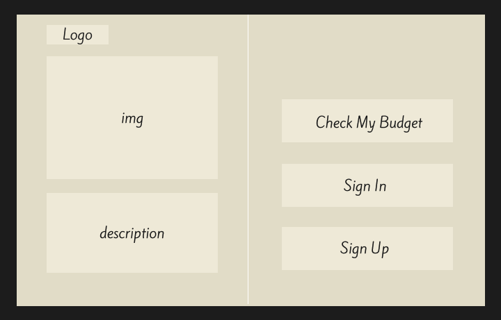
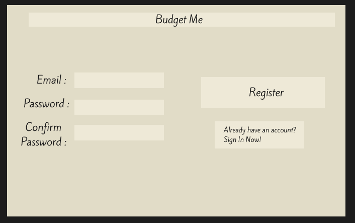
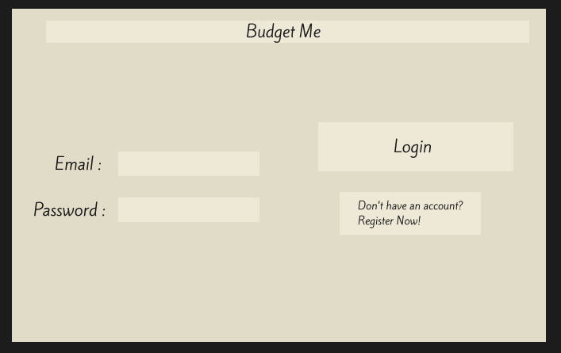
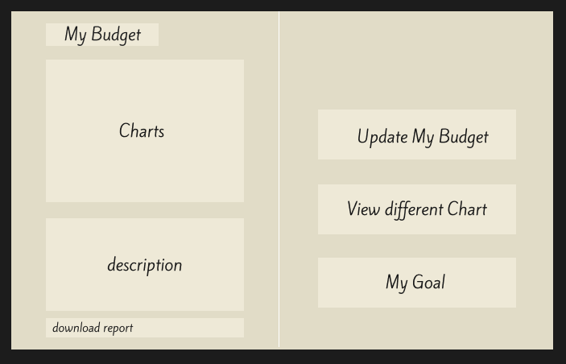
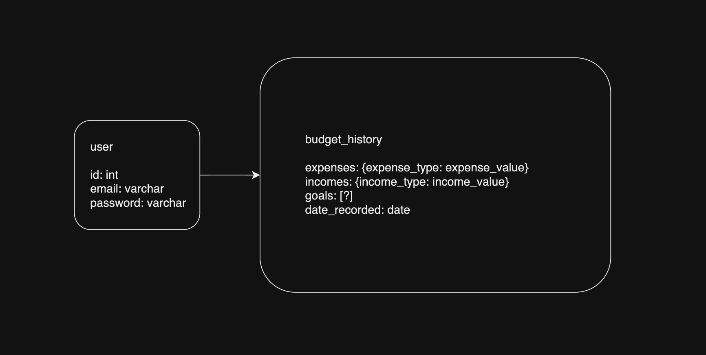

# Budget Me

## Overview

Budget Me is an app that allows user to track their spending and help them acheive financial freedom.

### Problem

Many struggle to manage their finances effectively, lacking awareness of their spending habits and finding it challenging to stick to a budget.

### User Profile

Budget Me caters to anyone in need of budgeting assistance, accommodating diverse user profiles

### Features

- As a user, I want to be able to input my monthly net income
- As a user, I want to be able to input my monthly expenses
- As a user, I want to be able to set saving goal
- As a user, I want to be able to forecast my savings/expenses


- As a user, I want to be able to create an account to manage my budget
- As a user, I want to be able to login to my account to manage my budget

- As a logged in user, I want to be able to update my income/expenses
- As a logged in user, I want to be able to see my current financial state in charts
- As a logged in user, I want to be able to filter expenses by category such as grocery, education, gas, shopping, rent, etc.

## Implementation

### Tech Stack

- React
- MySQL
- Express
- Client libraries: 
    - react
    - react-router
    - axios
    - Victory(charting library)
- Server libraries:
    - knex
    - express
    - bcrypt for password hashing

### APIs

- No external APIs will be used for the first sprint
- React Chart Library for charts (Likely Victory)

### Sitemap

- Home page
- My Budget (able to post/edit data, check charts)
- Login
- Register

### Mockups

#### Home Page


#### Register Page


#### Login Page


#### Budget Page



### Data



### Endpoints

**GET /budget**

- Get the current state of budget
Parameters:
- userId


Response:
```
{
  "expenses": {
    grocery: num, 
    education: num, 
    gas: num, 
    shopping: num,
    rent: num,
    etc: num, 
  },

  "income": {
    salary: num,
    investment: num,
    etc: num,
  },

  tbd
},
```

**POST /budget**

- Create the initial budget
- only one budget per user

Parameters:
- expenses
- incomes
- more tbd

Response:
```
{
  "expenses": {
    grocery: num, 
    education: num, 
    gas: num, 
    shopping: num,
    rent: num,
    etc: num, 
  },

  "income": {
    salary: num,
    investment: num,
    etc: num,
  },

  tbd
},
```

**PUT /budget**

- Logged in user can update their budget

Parameters:
- expenses
- incomes
- more tbd

Response:
```
{
  "expenses": {
    grocery: num, 
    education: num, 
    gas: num, 
    shopping: num,
    rent: num,
    etc: num, 
  },

  "income": {
    salary: num,
    investment: num,
    etc: num,
  },

  tbd
},
```

**POST /users/register**

- Add a user account

Parameters:

- email: User's email
- password: User's provided password

Response:
```
{
    "token": "seyJhbGciOiJIUzI1NiIsInR5cCI6IkpXVCJ9.eyJzdWIiOiIxMjM0NTY3ODkwIiwibmFtZSI6I..."
}
```

**POST /users/login**

- Login a user

Parameters:
- email: User's email
- password: User's provided password

Response:
```
{
    "token": "seyJhbGciOiJIUzI1NiIsInR5cCI6IkpXVCJ9.eyJzdWIiOiIxMjM0NTY3ODkwIiwibmFtZSI6I..."
}
```

### Auth

- JWT auth
    - Before adding auth, all API requests will be using a fake user with id 1
    - Added after core features have first been implemented
    - Store JWT in localStorage, remove when a user logs out
    - Add states for logged in showing different UI in places listed in mockups

## Roadmap

- Create client
    - react project with routes and boilerplate pages

- Create server
    - express project with routing, with placeholder 200 responses

- Create migrations

- Create seeds with sample budget

- Feature: Create an initial budget
    - User can input data in form
    - Call POST /budget

- Feature: View budget
    - Show user budget data over time in chart
    - Call GET /budget

- Feature: Edit budget
    - Call PUT /budget
    - Edit form similar to create

- Feature: Home page

- Feature: Create account
    - Implement register page + form
    - Create POST /users/register endpoint

- Feature: Login
    - Implement login page + form
    - Create POST /users/login endpoint

- Feature: Implement JWT tokens
    - Server: Update expected requests / responses on protected endpoints
    - Client: Store JWT in local storage, include JWT on axios calls

- Bug fixes

- DEMO DAY

## Nice-to-haves

- History section with time series data
    - Time range filtering
- Different chart types on view page
- Email notification
- Custom income and expense categories
- PDF reporting on demand
    - Download generated PDF
- Goal setting
    - Forecasting
    - Recommendations to stay on track